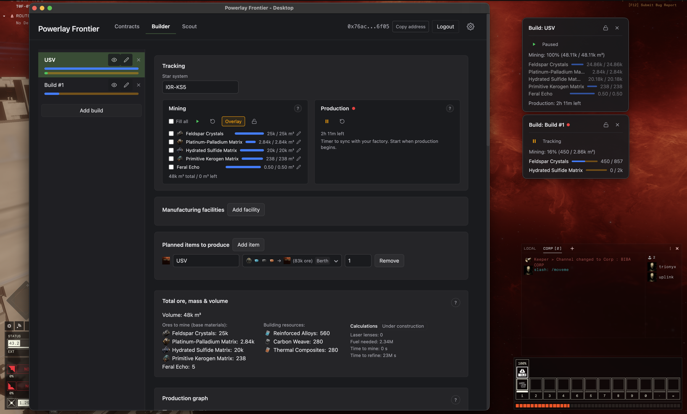
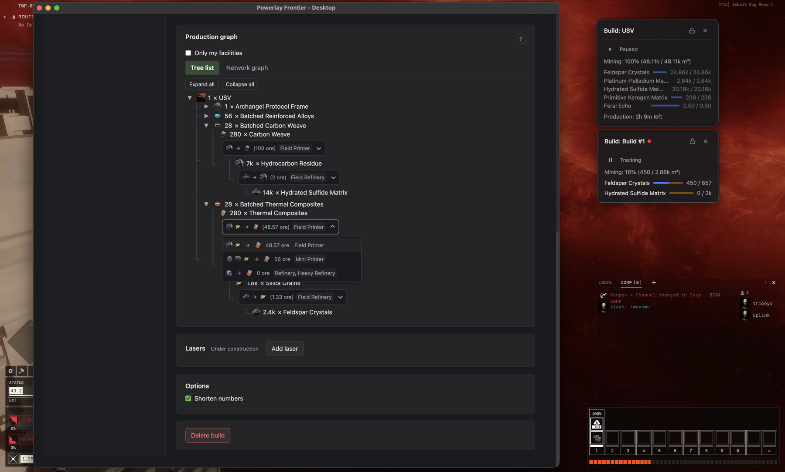
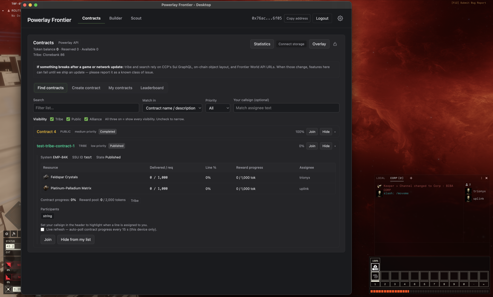
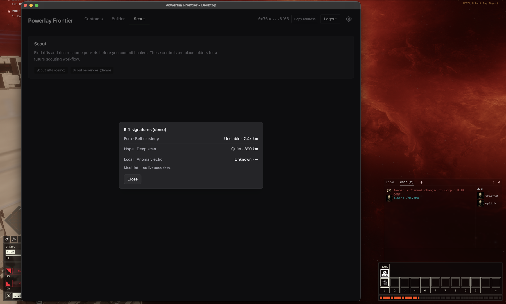
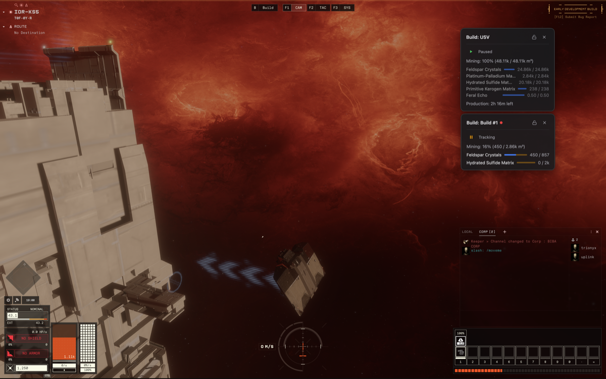

# Powerlay Frontier

**Community desktop companion for [EVE Frontier](https://evefrontier.com)** — production and mining planning, tribe coordination via contracts, and transparent in-game overlays. Available for **Windows** and **macOS**.

> 🚧 Active development 🚧 <br>
> Latest features and changes are in [Releases](https://github.com/Ravencraft-Labs/powerlay-frontier/releases)

Some features (Contracts, Scout) interact with the SUI Network and require a connected **EVE Wallet**.

**Community tool — not affiliated with CCP Games.** All game-related names, images, and assets are trademarks and/or copyrights of CCP hf.

---

## Modules

| Module | Status | Description |
|--------|--------|-------------|
| **Builder** | **stable** | Blueprints, production calculator, mining helper, ingredient breakdowns |
| **Contracts** | WIP | Create tribe and public contracts for coordination and rewards — requires EVE Wallet |
| **Scout** | WIP | System scanning and tracking tools|
| **Overlay** | **stable** | Transparent always-on-top panels rendered over the game window - available in different modules|

---

## Screenshots

<table>
  <tr>
    <td align="center"><b>Builder</b></td>
    <td align="center"><b>Different reciepes support</b></td>
  </tr>
  <tr>
    <td><a href="docs/screenshots/overview.png"></a></td>
    <td><a href="docs/screenshots/builder.png"></a></td>
  </tr>
  <tr>
    <td align="center"><b>Contracts</b></td>
    <td align="center"><b>Scout</b></td>
  </tr>
  <tr>
    <td><a href="docs/screenshots/contracts.png"></a></td>
    <td><a href="docs/screenshots/scout.png"></a></td>
  </tr>
  <tr>
    <td align="center" colspan="2"><b>In-game Overlays</b></td>
  </tr>
  <tr>
    <td colspan="2" align="center"><a href="docs/screenshots/overlay-ingame.png"></a></td>
  </tr>
</table>

---

## Safe Overlay Philosophy

Powerlay does not automate gameplay, read process memory, or inject into the game. The overlay is a separate transparent window — nothing touches the EVE Frontier client.

---

## Developer Setup

- Node 18+
- pnpm (or enable with `corepack enable`)

```bash
pnpm install
pnpm dev        # Start desktop UI (:5173), overlay UI (:5174), and Electron
```

### Build

Windows

```bash
pnpm build              # Build all packages
pnpm run build:portable     # Build Windows portable .exe (output in dist/)
```

macOS

```bash
CSC_IDENTITY_AUTO_DISCOVERY=false pnpm run build:mac    # Build unsigned macOS package (output in dist/)
```

### Test & Lint

```bash
pnpm test
pnpm lint
```

---

## Game data (required for Builder features)

The `data/` folder is in `.gitignore` (game data is large and not shared publicly). Developers need to obtain these files and place them as follows:

| File | Directory | Required | Notes |
|------|-----------|----------|-------|
| `types.json` | `data/stripped/` | **Yes** | Item types (typeID → name, volume, etc.). Place `data/raw/types.json` and `data/raw/groups.json`, then run `pnpm strip-data` to generate it. |
| `oreGroupIDs.json` | `data/stripped/` | **Yes** | Ore group IDs for mining tracking. Generated by `pnpm strip-data` from `groups.json`. |
| `industry_blueprints.json` | `data/raw/` | **Yes** | Industry blueprints (inputs/outputs, runTime). Place directly; no processing needed. |
| `industry_facilities.json` | `data/raw/` | No | Maps facilities to blueprints. Place directly. If missing, facility names are omitted from blueprint options. |
| `solarsystems.json` | `data/stripped/` | No | Star system names for live search in the Tracking tab. Place `data/raw/solarsystems.json` and run `pnpm strip-data` to generate it. If missing, the star system field is a free-text input. |
| `structure_recipes.json` | `data/stripped/` | No | Structure assembly recipes (Heavy Printer, etc.). Place `data/raw/spacecomponentsbytype.json` and run `pnpm strip-data` to generate it. If present, structures show building ingredients (e.g. Building Foam) in the production tree. |

**Directory layout:**
```
data/
  raw/
    industry_blueprints.json   ← required
    industry_facilities.json   ← optional (facility names on blueprints)
    types.json                 ← required (for pnpm strip-data)
    groups.json                ← required (for pnpm strip-data)
    solarsystems.json          ← optional (for pnpm strip-data)
    spacecomponentsbytype.json ← optional (for structure recipes)
  stripped/
    types.json                 ← from pnpm strip-data
    oreGroupIDs.json           ← from pnpm strip-data
    solarsystems.json          ← from pnpm strip-data (optional)
    structure_recipes.json     ← from pnpm strip-data (optional)
```

Without these files, the Builder tab will show a "Types loaded but empty" or "File not found" error.

## Scripts

- **`pnpm dev`** — Start desktop UI (Vite :5173), overlay UI (Vite :5174), then Electron. Use "Toggle overlay" in the desktop to show/hide the overlay.
- **`pnpm build`** — Build all packages.
- **`pnpm run build:portable`** — Build all packages and produce a Windows portable executable (no installer). Output is in `dist/`.
- **`pnpm run build:mac`** — Build Mac package. Output is in `dist/`.
- **`pnpm test`** — Run tests (core package).
- **`pnpm lint`** — Lint all packages.
- **`pnpm strip-data`** — Generate `data/stripped/types.json`, `data/stripped/oreGroupIDs.json`, and optionally `data/stripped/solarsystems.json` and `data/stripped/structure_recipes.json` from `data/raw/`. Requires `types.json` and `groups.json`. Run after placing fresh game data. See `data/raw/README.md` for full schema and file details.
- **`pnpm debug-graphql`** — Inspect GraphQL + optional `chainIdentifier` / Frontier package checks; resolves **`tribe_id`** like the app (`PlayerProfile` → `Character`, profile pick Utopia → Stillness → first). `pnpm debug-graphql -- <address> [url]`. Optional **`POWERLAY_EF_WORLD_API_BASE`** mirrors the app’s operator override for World API. See `docs/contracts-integration.md`.

## Structure

- `packages/core` — Pure logic (mining/build engine, contracts domain types, Tribe TODO helpers). No Electron/React.
- `packages/ui-desktop` — Main dashboard (Contracts, Builder, wallet login).
- `packages/ui-overlay` — Transparent overlay panel (contracts quick list, build tracking).
- `packages/electron-shell` — Main process, preload, IPC; contracts use a **configurable HTTP API** or an in-app mock. Configure **`POWERLAY_API_BASE`** (and related vars) as in `docs/contracts-integration.md` (do not publish production URLs in public docs). **Tribe:** on-chain **`Character.tribe_id`** via Sui GraphQL (default indexer + optional **`POWERLAY_EF_GRAPHQL_URL`**); Frontier **World API** for display name follows the profile’s world package — see `docs/contracts-integration.md`.

## Safe Overlay Philosophy

This app does not automate gameplay, read process memory, or inject into the game.

## License

[MIT](LICENSE)
