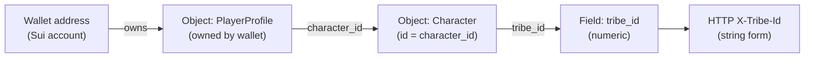

# Contracts backend integration

The desktop **Contracts** tab talks to a **contracts service** through **Electron IPC** (`window.efOverlay.contracts`). The **main process** calls a configured **HTTP API** for all contract operations.

**Security / disclosure:** This file describes behavior at a high level only. **Do not** put production or staging base URLs, API keys, or deployment-specific paths in public READMEs, changelogs, or issues. Route names, query shapes, and header contracts for a real deployment belong in **private operator docs** and **OpenAPI** shared out-of-band. Implementers working in this repo should read `packages/electron-shell/src/contracts/` (especially `contractsHttpBackend.ts` and the mappers) for exact requests.

## Configure API base

| Variable | Effect |
|----------|--------|
| `POWERLAY_API_BASE` | Root URL for the **Powerlay HTTP API** (contracts, storage, shared routes). Must include the version prefix your server uses (e.g. `…/api/v1`, no trailing slash). Example resolved paths: `POST {base}/contracts`, `GET {base}/storages`, `DELETE {base}/storages/{ssu_id}`. Storage routes require header **`X-Tribe-Id`**. Register body uses **`ssu_id`**, **`tx_hash`**, optional **`display_name`** (see `storageHttpBackend.ts`). (Replaces the former `POWERLAY_CONTRACTS_API_BASE` name.) |

Set env vars before starting Electron (shell, IDE launch config, or OS environment).

### How `{base}` maps to versioned routes

The client concatenates **paths relative to `POWERLAY_API_BASE`**. If your server exposes routes under `/api/v1/...`, set the base to include that prefix (e.g. `https://example.com/api/v1`, no trailing slash). Then:

- `POST {base}/contracts` → `POST /api/v1/contracts`
- `GET {base}/contracts`, `GET {base}/contracts/{id}`, `PUT {base}/contracts/{id}`, `POST {base}/contracts/{id}/publish`, `…/join`, `…/hide`, `…/cancel`, `…/complete` — same pattern
- `GET {base}/storages`, `POST {base}/storages`, `DELETE {base}/storages/{ssu_id}`

Routes such as `/api/v1/admin/...` or `/api/v1/internal/...` are **not** called from the Electron shell in this repo; they are for other services or future use.

### Storage schema sync (`app/schemas/storages.py`)

| Backend (wire) | Desktop `ConnectedStorage` / POST body |
|----------------|----------------------------------------|
| **Request** `ssu_id` | Sent as `ssu_id` (not `ssu_object_id`) |
| **Request** `display_name` | Sent when user enters a label (not `name`) |
| **Request** `tx_hash` | Sent after on-chain connect; backend model should include this field (or use `extra` policy that allows it) |
| **Response** `id` | `id` |
| **Response** `ssu_id` | `ssuObjectId` |
| **Response** `tribe_id` | `tribeId` |
| **Response** `owner_user_id` | `ownerUserId` (optional) |
| **Response** `owner_wallet` | `ownerWallet` (optional) |
| **Response** `display_name` | `name` |
| **Response** `is_active` | `isActive` (optional) |
| **Response** `tx_hash` (if added later) | `txHash` |
| **Response** `connected_at` (if added later) | `connectedAt`; else client uses parse-time `Date.now()` |

## Auth and context (conceptual)

The shell sends **stable caller identity** (in normal use derived from the connected wallet) and, when available, **tribe context** resolved from chain so the server can enforce visibility (public vs tribe/alliance vs creator). Optional dev-only overrides exist for local testing; names and wiring live in source, not here.

## How behavior maps to the API (no route catalog)

- **Discovery / search** — Browse and filters are implemented as HTTP calls from the main process; the UI may merge results when multiple visibility scopes are selected, according to what the server accepts per request.
- **Detail** — Expanding a row loads full contract detail from the server; tribe mismatch and similar cases surface as structured errors in the UI.
- **My contracts** — Tabs (all lifecycle views) use list IPC that prefers **bucketed** server listings when implemented, with fallbacks; the app may merge a **local draft id index** so drafts still appear if list endpoints omit them.
- **Create / update draft** — Create and full-document update flows send payloads built by the domain→backend mappers; the server is treated as authoritative for stored rows.
- **Publish / complete / cancel** — Success and error codes are mapped into UI results.
- **Reachability** — The main process performs a **minimal request** to decide if the service is up; the **configured URL is not shown** in the UI.

For **token balance**, **stats**, and other **optional** fields, the client maps whatever the server returns; some UI totals stay at defaults until the API exposes them.

### Shared storage model

A Powerlay-connected SSU operates as a **shared tribe stash**. The owner, tribe members, and (in a future phase) contract deliveries all interact with the **same open inventory** via `shared_deposit` / `shared_withdraw` in the `powerlay_storage` Move module. There is no personal owner slot inside a Powerlay-managed SSU; the owner uses the same shared path as any tribe member.

When a contract delivery eventually needs to place items into storage, it will use the same shared open inventory — no separate contract-only storage mode is needed. The `StorageConfig` object created by `connect_storage` (shared on-chain, identified by `ssu_id` in the backend) is the single configuration reference for both tribe and contract flows.

If the owner requires private/personal storage, that belongs on a separate SSU without the Powerlay extension installed.

### SSU tracking flag (optional API)

Draft create/update may send **`track_ssu_auto`** (boolean). Detail and list responses may include **`track_ssu_auto`** or alias **`ssu_tracking_enabled`**. When enabled for an **active** contract with a **target SSU id**, the desktop UI **polls** `GET /contracts/{id}` about every **15 seconds** while the row or expanded card is visible — so progress updated by a **separate watcher → backend** pipeline appears without manual refresh. The app does **not** subscribe to chain events.

After publish, toggling tracking is not done via draft update (which applies only while **`status === "draft"`**). The shell implements **`PATCH /contracts/{id}`** with JSON body **`{ "track_ssu_auto": true | false }`** for the creator; IPC channel **`contracts:patch-tracking`**. If the API does not support `PATCH` yet, the client may fall back to local-only polling (see UI code).

## Where code lives

| Layer | Path | Role |
|-------|------|------|
| Backend DTOs (loose JSON) | `packages/electron-shell/src/contracts/backendDto.ts` | Shapes as returned by JSON |
| DTO → domain | `packages/electron-shell/src/contracts/mapBackendToDomain.ts` | `LogisticsContract`, browse summaries, stats, publish errors |
| Domain → request body | `packages/electron-shell/src/contracts/mapDomainToBackend.ts` | Create/update payloads |
| HTTP transport | `packages/electron-shell/src/contracts/contractsHttpBackend.ts` | `fetch`, query strings, merge-on-update for PUT |
| IPC wiring | `packages/electron-shell/src/ipc/contractsHandlers.ts` | HTTP backend; error logging |

UI code should use **`@powerlay/core`** contract types and **`getContractsClient()`** in the renderer.

## Tribe resolution: EVE Frontier + Sui (how it fits together)

Contracts need a **numeric tribe id** and optionally a **display name**. In this stack those come from **two different systems**: Sui GraphQL (chain read) and the Frontier World API (tribe label). The app uses one **default public GraphQL URL** and picks the **World API host** from the **`PlayerProfile` Move type** (Utopia vs Stillness world package id), so operators do not configure shard URLs in Settings.

### Source of truth on Sui

- **Authoritative for `tribe_id`:** the on-chain **`Character`** Move object. The game writes and updates **`tribe_id`** there; tools only **read** it.
- **Link from wallet:** the wallet owns a **`PlayerProfile`** whose **`character_id`** field points at that **`Character`**.
- **GraphQL** is used to query those objects (wallet-owned objects → profile → load character). The app default targets public Sui testnet; override the indexer with **`POWERLAY_EF_GRAPHQL_URL`** when your deployment differs.

**Logical chain:**



Implementation: **`playerTribeFromChain.ts`**, **`tribeResolve.ts`** (Electron main). **Env:** **`POWERLAY_EF_GRAPHQL_URL`** (optional indexer override); timeout **`POWERLAY_EF_GRAPHQL_TIMEOUT_MS`** (default 10000).

**Multiple `PlayerProfile` objects:** the same wallet can own more than one profile (e.g. different published world packages). The app chooses **Utopia** package first, then **Stillness**, then the first profile in GraphQL order.

### Tribe display name (Frontier World API)

**`tribe_id`** on chain is a number. Human-readable tribe **name** / **nameShort** come from the Frontier **World API**: **`GET /v2/tribes/{id}`**. The app selects the World API **base URL** from the chosen profile’s world package (Stillness vs Utopia — official hosts under [EVE Frontier — Resources](https://docs.evefrontier.com/tools/resources)). Operators may force a single base with **`POWERLAY_EF_WORLD_API_BASE`** or disable name lookup with **`POWERLAY_EF_WORLD_API_DISABLE`**.

### Contracts visibility and tribe

Search and list flows may send **`X-Tribe-Id`** when resolved. If tribe resolution fails, the UI may restrict or warn (e.g. tribe-scoped contracts hidden until resolved). See **`ContractsAccessContext`** and **`docs/auth-architecture.md`** for UI gating.

## Support / diagnostics

**Application log:** `%APPDATA%\Powerlay\logs\powerlay.log` (Windows) — rotated NDJSON, one entry per line.

**Authorize Storage flow:** all telemetry events are written to `powerlay.log` with the prefix `[auth_storage_page]`. Filter with:

```
grep [auth_storage_page] powerlay.log
```

Each line captures a short event code (`page_open`, `params_ok`/`params_err`, `wallets_ready`/`wallets_help`, `sign_connect`, `ptb_A`/`ptb_B`, `sign_submit`, `sign_ok`/`sign_err`, `callback_ok`, `pagehide`, `window_error`, `unhandled_rejection`) plus `ms` elapsed since page load and any relevant short fields. A typical successful run produces 6–10 lines.
