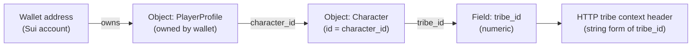

# Contracts backend integration

The desktop **Contracts** tab talks to a **contracts service** through **Electron IPC** (`window.efOverlay.contracts`). The **main process** either calls a configured **HTTP API** or an **in-memory mock** store.

**Security / disclosure:** This file describes behavior at a high level only. **Do not** put production or staging base URLs, API keys, or deployment-specific paths in public READMEs, changelogs, or issues. Route names, query shapes, and header contracts for a real deployment belong in **private operator docs** and **OpenAPI** shared out-of-band. Implementers working in this repo should read `packages/electron-shell/src/contracts/` (especially `contractsHttpBackend.ts` and the mappers) for exact requests.

## Configure HTTP vs mock

| Variable | Effect |
|----------|--------|
| `POWERLAY_CONTRACTS_API_BASE` | Root URL for the contracts HTTP API for your environment (must match what that environment’s API expects, including any version prefix). |
| `POWERLAY_CONTRACTS_USE_MOCK` | If `true` / `1` / `yes`, IPC uses the embedded mock store (no HTTP). |

Set env vars before starting Electron (shell, IDE launch config, or OS environment).

## Auth and context (conceptual)

The shell sends **stable caller identity** (in normal use derived from the connected wallet) and, when available, **tribe context** resolved from chain so the server can enforce visibility (public vs tribe/alliance vs creator). Optional dev-only overrides exist for local testing; names and wiring live in source, not here.

## How behavior maps to the API (no route catalog)

- **Discovery / search** — Browse and filters are implemented as HTTP calls from the main process; the UI may merge results when multiple visibility scopes are selected, according to what the server accepts per request.
- **Detail** — Expanding a row loads full contract detail from the server; tribe mismatch and similar cases surface as structured errors in the UI.
- **My contracts** — Tabs (all lifecycle views) use list IPC that prefers **bucketed** server listings when implemented, with fallbacks; the app may merge a **local draft id index** so drafts still appear if list endpoints omit them.
- **Create / update draft** — Create and full-document update flows send payloads built by the domain→backend mappers; the server is treated as authoritative for stored rows.
- **Publish / complete / cancel** — Success and error codes are mapped into UI results; mock mode simulates escrow where applicable.
- **Reachability** — In HTTP mode, the main process performs a **minimal request** to decide if the service is up; the **configured URL is not shown** in the UI.

For **token balance**, **stats**, and other **optional** fields, the client maps whatever the server returns; some UI totals stay at defaults until the API exposes them.

## Where code lives

| Layer | Path | Role |
|-------|------|------|
| Backend DTOs (loose JSON) | `packages/electron-shell/src/contracts/backendDto.ts` | Shapes as returned by JSON |
| DTO → domain | `packages/electron-shell/src/contracts/mapBackendToDomain.ts` | `LogisticsContract`, browse summaries, stats, publish errors |
| Domain → request body | `packages/electron-shell/src/contracts/mapDomainToBackend.ts` | Create/update payloads |
| HTTP transport | `packages/electron-shell/src/contracts/contractsHttpBackend.ts` | `fetch`, query strings, merge-on-update for PUT |
| IPC wiring | `packages/electron-shell/src/ipc/contractsHandlers.ts` | Chooses HTTP vs mock; error logging |

UI code should use **`@powerlay/core`** contract types and **`getContractsClient()`** in the renderer.

## Tribe resolution (client-side, public chain read)

Tribe is resolved in the **Electron main process** via **Sui GraphQL** (`playerTribeFromChain.ts`, `tribeResolve.ts`).

**Endpoint resolution order:** (1) **Settings** in the desktop app (`efGraphqlUrl` in `settings.json`), (2) env **`POWERLAY_EF_GRAPHQL_URL`**, (3) built-in default for the packaged network. Users can override in **Settings → Contracts & tribe**.

**`POWERLAY_EF_GRAPHQL_TIMEOUT_MS`** (default 10000) controls the fetch timeout.

If lookup fails, the UI shows a warning; contract search stays **public-only** until tribe is resolved.

### Path from wallet to character tribe (`tribe_id`)

On the game’s Sui deployment, tribe membership for contracts is keyed off a **numeric id** on the player’s **Character** object. The wallet address is an **account**; the **Character** is a **separate object**. The link is a **PlayerProfile** object **owned** by the wallet.

**Logical chain (high level):**

1. After login, the app has the player’s Sui address (used as the GraphQL `address` filter).
2. Among objects **owned by that address**, find a Move object whose type matches the game’s **PlayerProfile** pattern (see source for the exact substring match).
3. Read **`character_id`** from that object’s JSON, then load that object as **Character** and read **`tribe_id`**.
4. The shell sends that value in string form as tribe context for HTTP calls (exact header name in `contractsHttpBackend.ts`).

**Why two requests?** The wallet object does not embed `tribe_id`; you discover the Character via the profile, then load it.

**What is *not* on the chain-only path**

- **Tribe display name** — Character JSON may include a **character** name, not the tribe **name**; a readable tribe label requires the optional HTTP step below (or stays unset).
- **Other owned objects** — Useful for debugging, but **tribe_id** for contracts comes from the **Character** object as above.

### Optional tribe display name (separate HTTP service)

The chain path yields a **numeric tribal id**. The app may call a **separate configurable HTTP service** to resolve a display name for the UI. Base URL, timeout, and disable flags are set in **Settings** and environment variables; **defaults and path templates are only in source** (`playerTribeFromChain.ts`, settings UI)—do not treat public markdown as authoritative for production endpoints.

**Other networks:** Use GraphQL for the **same network** as the player’s objects. Type matching uses stable **suffixes** on Move type names so different package ids still match (see source).

**Debug script:** From the repo root, copy your wallet from the header (**Copy address**), then run `pnpm debug-graphql` with the address (optional GraphQL URL). See `scripts/debug-ef-graphql.mjs` for usage.

## Related docs

- **OpenAPI / operator docs:** Obtain from whoever runs the contracts API you connect to; do not rely on this file for path-by-path specs.
